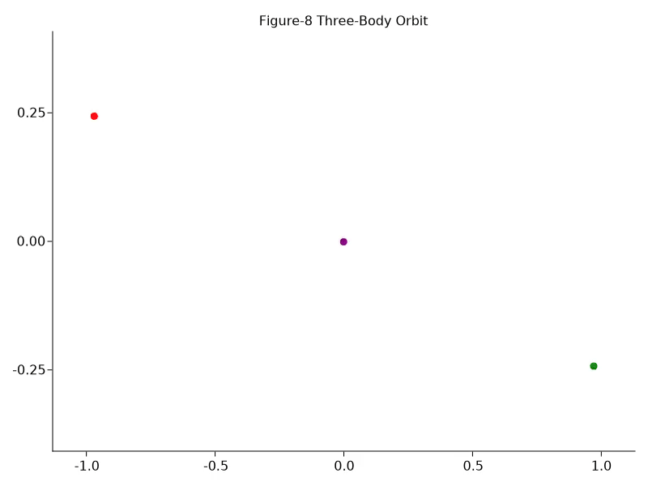
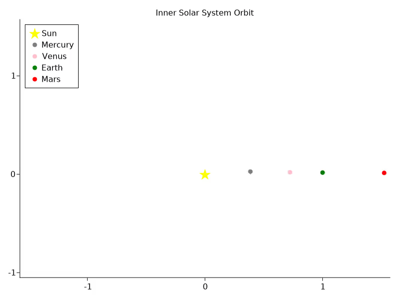
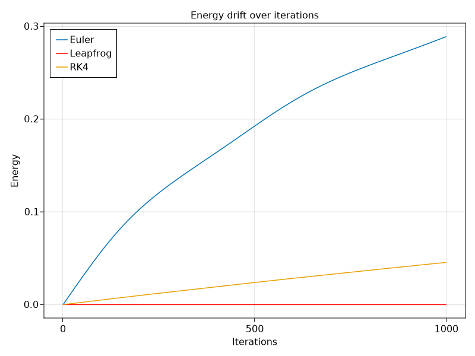
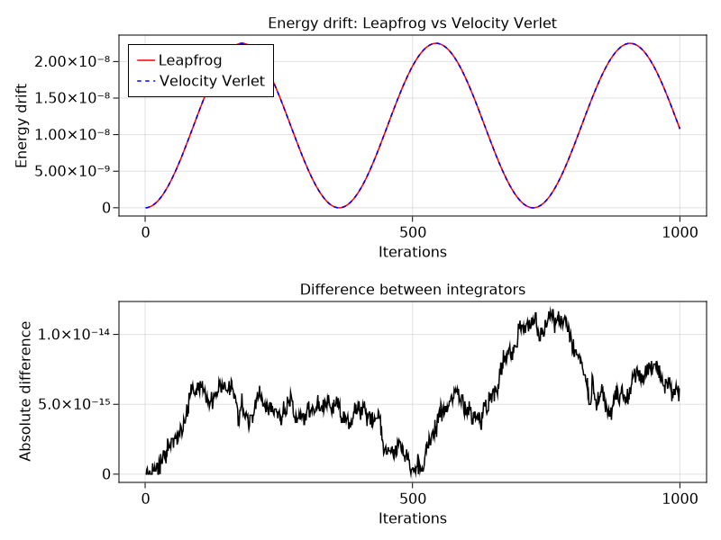

# NBodySim.jl

A gravitational N-body simulator in Julia, featuring four numerical integrators with a symplectic conservation analysis

<div style="display: flex; gap: 20px;">
  <div>
    
    <p style="text-align: center;"><strong>Figure 8 Three-Body Orbit</strong></p>
  </div>
  <div>
    
    <p style="text-align: center;"><strong>Solar System</strong></p>
  </div>
</div>

# Overview

The N-body problem has no general closed-form solution, so we rely on numerical integration to approximate the motion of the system over time. However, not all numerical integrators are equal. While different methods may produce similar results over short time intervals, their behavior can differ significantly when the simulation is run for many thousands or millions of steps.

In particular, the choice of integrator has a major impact on how well important physical properties, such as total energy and angular momentum, are preserved over long time scales. A method that appears accurate initially can gradually introduce numerical errors that accumulate over the course of a simulation, potentially causing the system to gain or lose energy artificially and diverge from physically plausible behavior.

That is the main idea this project explores: the choice of numerical integrator matters just as much as the equations being integrated.

This project implements an N-body simulator in Julia and uses it to compare different integration methods, examining not only the resulting trajectories but also their long-term numerical stability and conservation of physical quantities. The goal is not simply to simulate gravitational systems, but to visualize and quantify how different numerical methods behave when applied to the same physical problem.

One call site, four integrators, zero other changes:

```jl
system = make_system(bodies)

simulate(system, Euler(),          dt, n_steps)
simulate(system, Leapfrog(),       dt, n_steps)
simulate(system, RK4(),            dt, n_steps)
simulate(system, VelocityVerlet(), dt, n_steps)
```

### Why Julia?

Julia was used in this project for the following reasons:

- **Multiple dispatch is the natural fit for the integrator pattern.** In other languages, we'd resort to class inheritance and method overriding. In Julia, a single `step!` function dispatching an integrator type is far more expressive and less verbose than OOP languages.
- **Performance without sacrifice.** Julia runs at C-like speeds without leaving the high-level language. For an O($n^2$) force computation called thousands of times per simulation, it matters.
- **StaticArrays.** Fixed-sized stack-allocated 3-vectors are the best fit for position and velocity data, no heap allocation per body per step.

# Usage

**Requirements:** Julia 1.8 or later.

Clone the repository and instantiate the package:

```sh
git clone https://github.com/midyh/NBodySim.jl
cd NBodySim.jl
julia --project=.
```

Then in the Julia REPL:

```julia
] instantiate

using NBodySim

# Define bodies
b1 = Body(SA[-0.97000436, 0.24308753, 0.0], SA[0.93240737/2, 0.86473146/2, 0.0], 1.0)
b2 = Body(SA[0.97000436, -0.24308753, 0.0], SA[0.93240737/2, 0.86473146/2, 0.0], 1.0)
b3 = Body(SA[0.76, 0.0, 0.0], SA[-0.93240737, -0.86473146, 0.0], 1.0)
system = System([b1, b2, b3])

# Run simulation, swap integrator with zero other changes
s = simulate(system, Leapfrog(), 0.01, 1000)

# Create an animation from the simulation
animate(s)
```

To run the test suite:

```sh
julia --project=. -e "using Pkg; Pkg.test()"
```

To reproduce the visualizations, run the scripts in `examples/`:

```sh
julia --project=. examples/figure8.jl
julia --project=. examples/solar_system.jl
```

# Architecture

## Core Types

This simulator is built around two structures. `Body` represents a single particle in the system, holding its position, velocity and mass as fields:

- `position::SVector{3,Float64}`
- `velocity::SVector{3,Float64}`
- `mass:Float64`

Position and velocity use `StaticArrays.SVector` rather than Julia's `Vector` so that heap allocation is avoided.

`System` is a thin wrapper holding `Vector{Body}`, the full state of the simulation at any given point in time.

## Integrators and Multiple Dispatch

The integrator hierarchy is the focal point of the project. An abstract type `Integrator` sits at the top, with four subtypes:

```jl
abstract type Integrator end

struct Euler          <: Integrator end
struct Leapfrog       <: Integrator end
struct RK4            <: Integrator end
struct VelocityVerlet <: Integrator end
```

Each integrator is an empty struct. It carries no data and only exists as a type for dispatch. The `step!` function is defined seperately for each:

```jl
step!(integrator::Euler,          system, dt)
step!(integrator::Leapfrog,       system, dt)
step!(integrator::RK4,            system, dt)
step!(integrator::VelocityVerlet, system, dt)
```

Julia's multiple dispatch selects the correct method at runtime based on the type of `integrator`. The call site `simulate(system, integrator, dt, n_steps)` is identical regardless of which integrator is passed. No conditionals, no inheritance chain, no method overriding. Swapping integrators is a one-argument change.

## Physics

At each timestep, `get_accelerations(system, G)` computes the net gravitational acceleration on every body via direct pairwise summation: O($n^2$) in the number of bodies. For each pair $(i, j)$:

$$\vec{a}_i \mathrel{+}= \frac{G m_j}{|\vec{r}_{ij}|^3} \vec{r}_{ij}, \quad \vec{r}_{ij} = \vec{x}_j - \vec{x}_i$$

Each integrator's `step!` method calls `get_accelerations` one or more times per step (once for Euler, twice for Leapfrog and Velocity Verlet, four times for RK4) and uses the result to update positions and velocities on each `Body` in place.

# Integrators

The four integrators implemented in this project represent a cross-section of classical numerical methods for ordinary differential equations, chosen to illustrate the tradeoff between accuracy, computational cost, and long-term conservation properties.

| Integrator      | Order | Symplectic | Force evaluations per step |
| --------------- | ----- | ---------- | -------------------------- |
| Euler           | 1st   | No         | 1                          |
| Leapfrog        | 2nd   | Yes        | 2                          |
| Velocity Verlet | 2nd   | Yes        | 2                          |
| RK4             | 4th   | No         | 4                          |

## Euler

The simplest possible integrator. At each step, velocities and positions are updated using only the current acceleration. No information about how the derivative changes over the step is used:

$$\vec{v}^{\,n+1} = \vec{v}^{\,n} + \vec{a}^{\,n} \, \Delta t$$
$$\vec{x}^{\,n+1} = \vec{x}^{\,n} + \vec{v}^{\,n} \, \Delta t$$

Euler is first-order accurate, meaning that local truncation error scales as $O(\Delta t^2)$, and global error accumulates as $O(\Delta t)$. It is not symplectic, meaning it does not conserve a modified Hamiltonian, and energy drifts monotonically over time. It serves as the baseline against which all other integrators are compared.

## Leapfrog

A symplectic second-order integrator that splits the velocity update into two half-kicks, with a full position update in between:

$$\vec{v}^{\,n+1/2} = \vec{v}^{\,n} + \vec{a}^{\,n} \cdot \frac{\Delta t}{2}$$
$$\vec{x}^{\,n+1} = \vec{x}^{\,n} + \vec{v}^{\,n+1/2} \cdot \Delta t$$
$$\vec{v}^{\,n+1} = \vec{v}^{\,n+1/2} + \vec{a}^{\,n+1} \cdot \frac{\Delta t}{2}$$

The half-step offset between position and velocity is what gives Leapfrog its symplectic property. It exactly conserves a modified Hamiltonian close to the true one, bounding energy oscillation near machine epsilon over arbitrarily long simulations.

## Velocity Verlet

Structurally distinct from Leapfrog but mathematically equivalent at the same timestep. Position is updated using both current velocity and current acceleration:

$$\vec{x}^{\,n+1} = \vec{x}^{\,n} + \vec{v}^{\,n} \, \Delta t + \frac{1}{2} \vec{a}^{\,n} \, \Delta t^2$$
$$\vec{v}^{\,n+1} = \vec{v}^{\,n} + \frac{1}{2} \left( \vec{a}^{\,n} + \vec{a}^{\,n+1} \right) \Delta t$$

Like Leapfrog, it is symplectic and second-order. In practice, the two methods produce numerically identical trajectories at the same $\Delta t$, a result confirmed empirically in this project and consistent with their shared theoretical foundation.

## RK4

A classical fourth-order Runge-Kutta method that samples the derivative at four points across each timestep and combines them in a weighted average:

$$\vec{y}^{\,n+1} = \vec{y}^{\,n} + \frac{\Delta t}{6} \left( k_1 + 2k_2 + 2k_3 + k_4 \right)$$

where $\vec{y} = (\vec{x}, \vec{v})$ is the full state vector and each $k_i$ requires a fresh evaluation of `get_accelerations` at a hypothetical intermediate state. RK4 achieves much higher per-step accuracy than Euler, but is not symplectic since energy still drifts monotonically, just roughly an order of magnitude more slowly. For long-running orbital simulations, Leapfrog outperforms RK4 on conservation despite being lower order.

## Energy Drift Comparison

The plot below shows total energy over 1000 steps for all four integrators on the same initial conditions ($\Delta t = 0.01$, circular two-body orbit):

<div style="display: flex; gap: 20px;">
  <div>
    
    <p style="text-align: center;"><strong>Energy drift comparison between the four integrators</strong></p>
  </div>
  <div>
    
    <p style="text-align: center;"><strong>Energy drift comapred between the two symplectic integrators</strong></p>
  </div>
</div>

Euler diverges rapidly. RK4 drifts slowly but monotonically. Leapfrog and Velocity Verlet remain bounded near the initial energy value, their curves are indistinguishable at this scale, consistent with their theoretical equivalence.

# Conservation Tests

A core claim of this project is that different integrators preserve physical invariants to different degrees. The test suite in `test/runtests.jl` makes this claim concrete with `@test` assertions grounded in theory rather than arbitrary tolerances.

## Conserved Quantities

Three physical invariants are tested:

**Total linear momentum:**
$$\vec{p}_{total} = \sum_i m_i \vec{v}_i$$

**Total angular momentum:**
$$\vec{L}_{total} = \sum_i m_i \left( \vec{x}_i \times \vec{v}_i \right)$$

**Total energy:**

```math
E = \sum_i \frac{1}{2} m_i |\vec{v}_i|^2 - \sum_{i < j} \frac{G m_i m_j}{|\vec{x}_i - \vec{x}_j|}
```

## Test Setup

All tests use the same initial conditions: a two-body circular orbit with $m_1 = 2$, $m_2 = 1$, separation $r = 1$, $G = 1$, and analytically derived circular orbit velocities. This gives an initial energy of exactly $-1.0$ and zero net momentum, quantities that are easy to verify by hand and meaningful to track over time.

## Tiered Tolerances

Not all integrators are expected to conserve all quantities equally well. The test suite reflects this with tiered assertions:

**Linear momentum** is conserved to near machine epsilon by all four integrators. This follows directly from Newton's third law, since internal force pairs always cancel in the sum regardless of the integration scheme. All four integrators assert `initial_momentum ≈ m` at every step.

**Angular momentum and energy** tell a more nuanced story:

| Integrator      | Angular momentum                         | Energy                   |
| --------------- | ---------------------------------------- | ------------------------ |
| Euler           | Drifts ~ $3.46 \times 10^{-4}$ per step  | Drifts monotonically     |
| Leapfrog        | Bounded at machine epsilon ~($10^{-16}$) | Bounded within $10^{-4}$ |
| Velocity Verlet | Bounded at machine epsilon ~($10^{-16}$) | Bounded within $10^{-4}$ |
| RK4             | Drifts ~ $2.89 \times 10^{-5}$ per step  | Drifts monotonically     |

The drift ratio between Euler and RK4 (~12x) reflects their order difference: Euler is first-order, RK4 is fourth-order. Leapfrog and Velocity Verlet's machine-epsilon conservation is a consequence of their symplectic structure: they exactly preserve a modified Hamiltonian close to the true one.

## Assertion Strategy

Rather than using a single tolerance for all integrators, the test suite asserts different things for different methods:

- **Leapfrog / Velocity Verlet:** `norm(initial_angular - a) < 1e-10` at every step. Conservation to well below any physically meaningful threshold
- **Euler / RK4:** `norm(initial_angular - angulars[end]) > threshold`: asserting that drift _exists_ and is consistent with known first-order / non-symplectic behavior. A method that accidentally conserved angular momentum would be suspicious, not reassuring.

This asymmetry is intentional: the tests document the _expected behavior_ of each method, not just whether it passes an arbitrary threshold.

# Benchmarks

Performance was measured using `BenchmarkTools.jl`'s `@benchmark` macro on a fresh system instance for each integrator, isolating timing from simulation state mutation. Results below are for 1000 steps on a two-body system:

| Integrator      | Median time | Force evaluations per step |
| --------------- | ----------- | -------------------------- |
| Euler           | 48.625 μs   | 1                          |
| Leapfrog        | 79.75 μs    | 2                          |
| Velocity Verlet | 78 μs       | 2                          |
| RK4             | 373 μs      | 4                          |

The timing ratio between integrators tracks closely with their force evaluation count — confirming that `get_accelerations` dominates the per-step cost, as expected for an O(N²) pairwise computation. Leapfrog and Velocity Verlet are approximately 2x the cost of Euler; RK4 approximately 4x. Given that Leapfrog delivers symplectic conservation at only 2x the cost of Euler, it is the natural default choice for long-running simulations.

# Project Structure

```py
NBodySim.jl/
├── .github/
│ └── workflows/
│ └── CI.yml # Runs Pkg.test() on every push
├── src/
│ ├── animations.jl # The animation function
│ ├── NBodySim.jl # Module entry point and exports
│ ├── types.jl # Body and System structs
│ ├── integrators.jl # Integrator hierarchy and step! methods
│ ├── dynamics.jl # get_accelerations — pairwise force computation
│ └── diagnostics.jl # total_energy, total_momentum, total_angular_momentum
├── test/
│ ├── runtests.jl # Test entry point
│ └── conservation_tests.jl # Conservation and energy drift assertions
├── benchmark/
│ └── compare_integrators.jl # BenchmarkTools timing and energy drift plots
├── examples/
│ ├── figure8.jl # Figure-8 three-body orbit animation
│ └── solar_system.jl # Inner solar system simulation
├── docs/
│ └── images/ # Generated plots and animations for README
├── Project.toml
└── README.md
```

# References

1. Chenciner, A. & Montgomery, R. (2000). _A remarkable periodic solution of the three-body problem in the case of equal masses._ Annals of Mathematics, 152(3), 881–901.
2. Hairer, E., Lubich, C., & Wanner, G. (2003). _Geometric numerical integration illustrated by the Störmer–Verlet method._ Acta Numerica, 12, 399–450. — the standard reference for symplectic integrators and long-term conservation properties.
3. Press, W. H., et al. (2007). _Numerical Recipes: The Art of Scientific Computing_ (3rd ed.). Cambridge University Press. — Chapter 17 covers ODE integration methods including RK4.
4. Bezanson, J., et al. (2017). _Julia: A fresh approach to numerical computing._ SIAM Review, 59(1), 65–98.
5. Danisch, S. & Krumbiegel, J. (2021). _Makie.jl: Flexible high-performance data visualization for Julia._ Journal of Open Source Software, 6(65), 3349.
6. Kristoffer Carlsson et al. _StaticArrays.jl._ https://github.com/JuliaArrays/StaticArrays.jl
